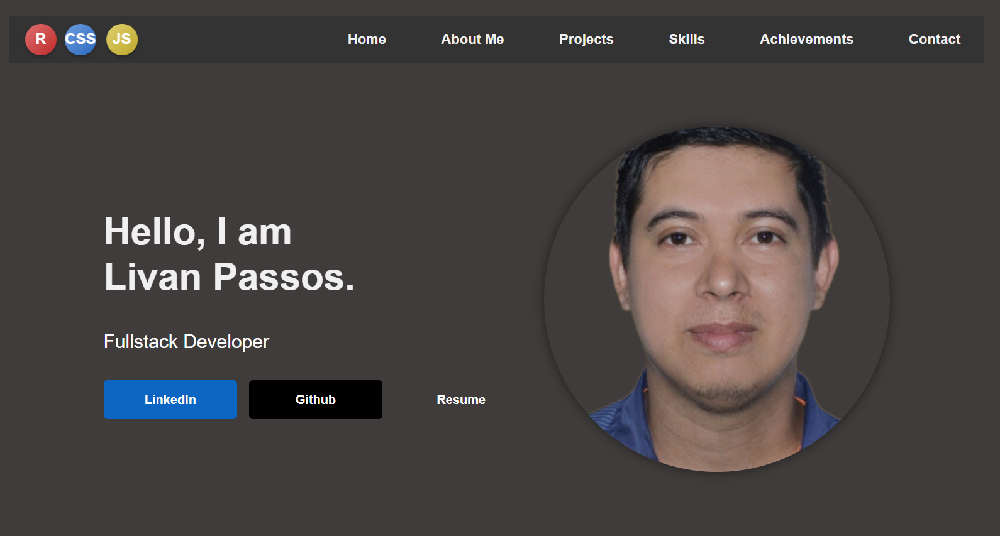

# 🚀 Livan Passos Portfolio

Personal portfolio developed with Ruby on Rails.

This project was created to showcase my backend, full stack and industrial technology projects in a modern and responsive way.

---

## 🌐 Live Website

https://livanpassos.com

---

## 🛠 Technologies Used

- Ruby on Rails
- HTML5
- CSS3
- JavaScript
- PostgreSQL
- Docker
- Linux

---

## ✨ Features

- Responsive design
- Modern UI
- Project showcase section
- Contact section
- Smooth animations
- Backend structure with Rails

---

## 📸 Preview



---

## 🚀 Running Locally

```bash
git clone https://github.com/livansena/my_portfolio.git

cd my_portfolio

bundle install

rails server
```

---

## 👨‍💻 Author

Livan Passos

- LinkedIn: https://linkedin.com/in/livanpassos
- Portfolio: https://livanpassos.com
